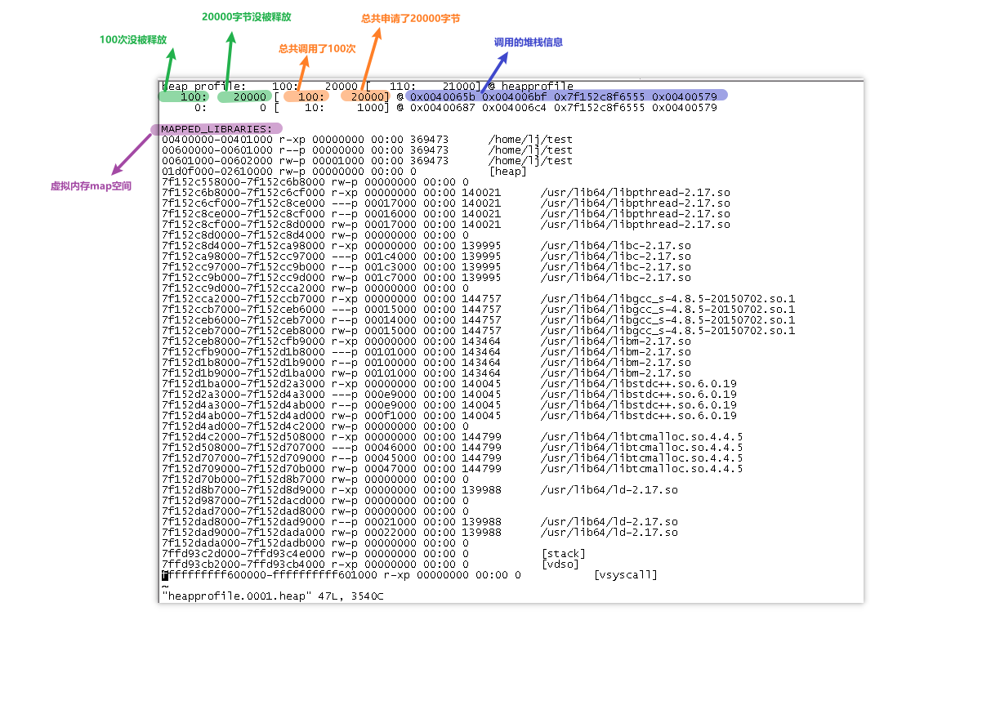

## gperftools heap-checker 内存分析工具
### 1. 安装
> 1. 安装tcmalloc等链接库:  ```yum install gperftools-devel```
> 2. 安装分析工具：```yum install pprof```
> 3. 或者从源码安装：```https://github.com/gperftools/gperftools   autogen.sh && ./configure && make```
### 2. 链接:
> 执行文件链接```libtcmalloc.so```，替换glibc里原生的```malloc、free、new、delete```等内存操作函数；
>>**方法 1**: 编译期链接: 
>>>```g++ -g -O0 test.cpp -L/lib64/ -ltcmalloc -o ./test```
>>
>>**方法 2**: 运行期链接: 
>>>```g++ -g -O0 test.cpp -o test```
>>>```env LD_PRELOAD=/lib64/libtcmalloc.so ./test```

### 3. 运行：
>```env HEAPCHECK=normal HEAPROFILE=/tmp/heapprofile HEAP_CHECK_IDENTIFY_LEAKS=1 LD_PRELOAD=/lib64/libtcmalloc.so ./test```
>>**环境变量名解释**：
>>1. ```HEAPCHECK=normal``` 获取数据的模式,通常用normal模式
>>2. ```HEAPROFILE=/tmp/heapprofile``` 内存快照的文件名
>>3. ```HEAP_CHECK_IDENTIFY_LEAKS=1``` 内存快照里包含调用堆栈信息
>>4. ```LD_PRELOAD=/lib64/libtcmalloc.so``` 优先链接libtcmalloc.so里的函数
### 4. 获取内存快照数据：
>在```/tmp/```目录下每隔一段时间会生成
>```heapprofile.0001.heap、 heapprofile.0002.heap、heapprofile.0003.heap``` ......, 
其中```heapprofile```为```HEAPROFILE```环境变量的值。
### 5. 内存快照文件格式
```
#include<string>
#include<stdlib.h>
#include<unistd.h>

void
Leak20000Func()
{
    for(int i = 0; i < 100; ++i>)
    {
        char *leak_200_bytes = (char*)malloc(200);
    }
    return ;
}

void
NoLeak1000Func()
{
    for(int i = 0; i < 10; ++i)
    {
        char *no_leak_100_bytes = (char*)malloc(100);
        if(no_leak_100_bytes)
            free(no_leak_100_bytes);
    }
    return ;
}

int
main(int argc, char** argv)
{
    Leak20000Func();
    NoLeak1000Func();
    return 0;
}
```
**以上代码对应的内存快照为**：

### 6. 用pprof工具分析内存快照文件
>**不同格式输出**
>>```pprof --text test heapprofile.0001.heap```
>>
>>```pprof --pdf test heapprofile.0001.heap > heapprofile.0001.heap.pdf```
>>
>>```pprof --svg test heapprofile.0001.heap> heapprofile.0001.heap.svg```

>**输出调用堆栈信息**
>>```pprof --text --stacks test heapprofile.0001.heap```

>**比对两个快照的变化**
>>```pprof --svg --lines --base=heapprofile.0001.heap test heapprofile.0003.heap```

>**更多信息**
>>```pprof --help```
### 7. 代码中手动输出快照
```
#include<string>
#include<stdlib.h>
#include<unistd.h>
#include<gperftools/heap-profiler.h>
#include<gperftools/heap-checker.h>

void
Leak20000Func()
{
    for(int i = 0; i < 100; ++i>)
    {
        char *leak_200_bytes = (char*)malloc(200);
    }
    return ;
}

void
NoLeak1000Func()
{
    for(int i = 0; i < 10; ++i)
    {
        char *no_leak_100_bytes = (char*)malloc(100);
        if(no_leak_100_bytes)
            free(no_leak_100_bytes);
    }
    return ;
}

int
main(int argc, char** argv)
{
    HeapProfilerStart("heapfile");
    Leak20000Func();
    HeapProfilerDump("DumpOutReason1");
    NoLeak1000Func();
    HeapProfilerDump("DumpOutReason2");
    HeapProfilerStop();
    return 0;
}
```
> 注：
>>```HeapProfilerStart("heapfile")```: 开启分析,输入参数为生成的内存快照文件名称；
>>
>>```HeapProfilerDump("DumpOutReason1")```: 输出内存快照，参数为输出的原因；
>>
>>```HeapProfilerDump("DumpOutReason2")```: 生成第二个内存快照文件;
>>
>>```HeapProfilerStop()```: 停止分析;

### 8. 其它常用环境变量
```HEAP_PROFILE_ALLOCATION_INTERVAL```: 默认1073741824 (1 Gb), 每增长多少内存输出一个内存快照信息。

```HEAP_PROFILE_INUSE_INTERVAL```: 默认104857600 (100 Mb), 每一次性分配大于此值时输出一个内存快照信息。
### 9. 参考资料
```http://pages.cs.wisc.edu/~danb/google-perftools-0.98/heapprofile.html```

```http://pages.cs.wisc.edu/~danb/google-perftools-0.98/heap_checker.html```
